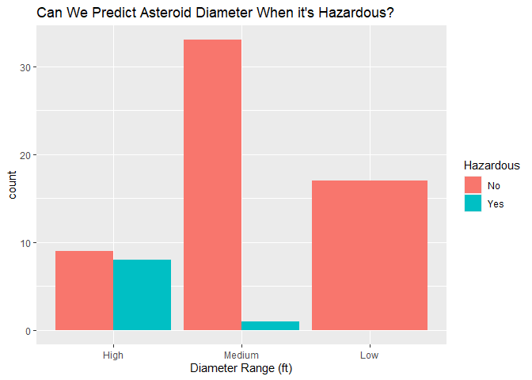
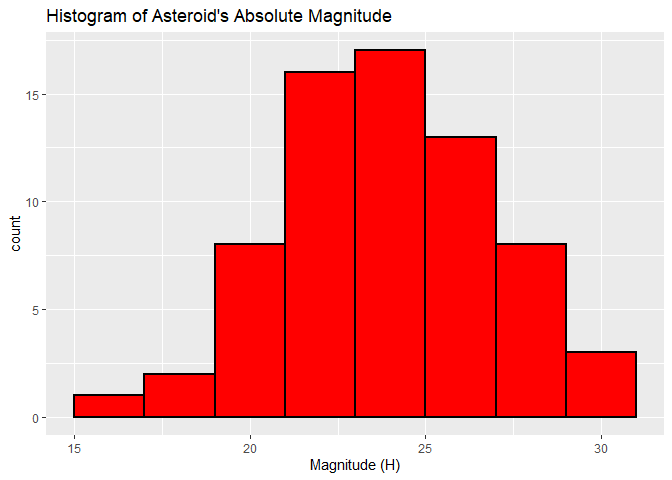
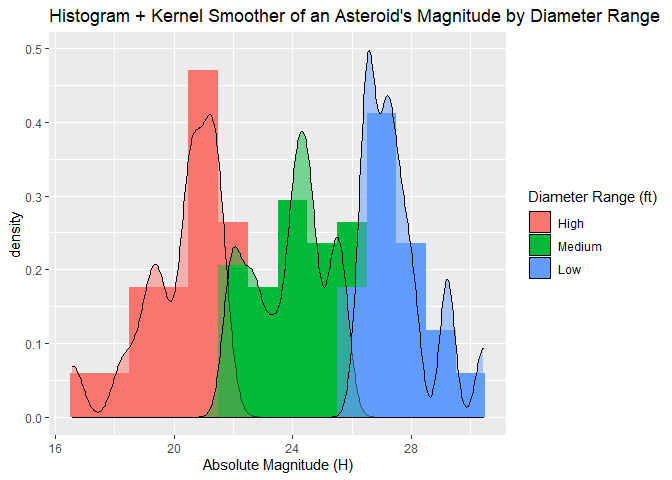
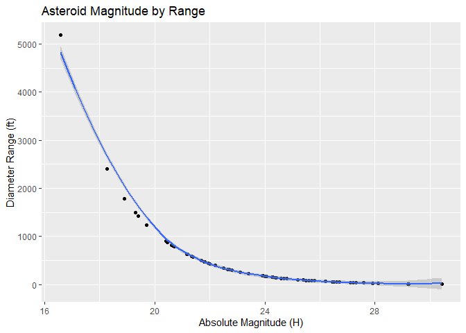
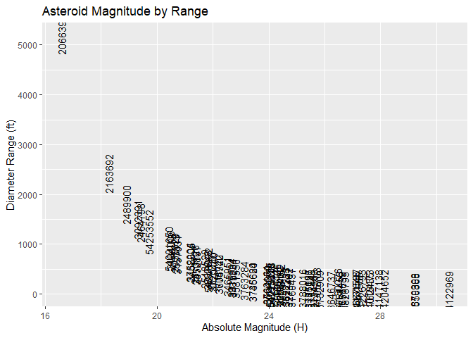
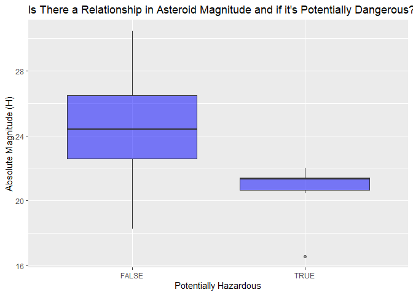

Interacting with APIs: NASA API
================
Steph Camino
2022-06-08

Welcome! This is project 1 for St558 at NC State! Here you will see a
vignette I have created about contacting [NASA
API](https://api.nasa.gov/index.html#browseAPI) using functions I wrote
to query, parse, and return data. At the end will be a small exploratory
analysis on the data I returned from the functions I created.

The data we will be exploring from NASA is from NeoWs (Near Earth Object
Web Service), which gathers data every day from Asteroids near earth.

# Required Packages

Before interacting with the API, I had to load some R packages to gain
access to some functions.

## Libraries Used:

-   [httr](https://cran.r-project.org/web/packages/httr/vignettes/quickstart.html):
    I used `GET()` from this package to access the NASA API.  
-   [jsonlite](https://cran.r-project.org/web/packages/jsonlite/index.html):
    I used `fromJSON()` from this package which reads data from file
    path or character string and converts and simplifies it to an R
    object.  
-   [tidyverse](https://www.tidyverse.org/): “TidyVerse” is a collection
    of R packages that share common philosophies and are designed to
    work together. “dplyr” is one of the collection of R packages that
    is also loaded when loading “TidyVerse.” From “dplyr,” `as_tibble()`
    is used to convert the data frame to a tibble. `group_by()` is also
    from “dplyr,” it groups rows by a variable. Also from “dplyr,”
    `summarise()` is used to apply basic functions to data. Another
    package I used from “TidyVerse” is “ggplot2” and from this package I
    used `ggplot()` to create the plots.  
-   [lubridate](https://cran.r-project.org/web/packages/lubridate/vignettes/lubridate.html):
    I used `ymd()` from this package to convert a string to a date.  
-   [knitr](https://www.r-project.org/nosvn/pandoc/knitr.html): I used
    `opts_chunk$set()` from the “knitr” package to set a path for the
    images created to be saved at. This is used so the images will show
    up on GitHub. If you can see the plots at the end of this page that
    means it worked!

``` r
library(httr)
library(dplyr)
library(jsonlite)
library(tidyverse)
library(lubridate)
library(knitr)
```

# NASA API Interaction Functions

This section includes the functions I wrote which interacts with the
[NASA API](https://api.nasa.gov/index.html#browseAPI), specifically the
Asteroids NeoWs (Near Earth Object Web Service), to create a dataset of
near-earth asteroids.

## Setup

This subsection connects to the API and grabs information used to create
the data in the following functions.

``` r
# Connecting to NASA API about Asteroid Sightings
APIData <- GET("https://api.nasa.gov/neo/rest/v1/feed?start_date=2022-06-01&end_date=2022-06-07&api_key=r6dkgZPsg9wTctOy0pRVe3Ldhgk7mjcHZGuJMeNc")
```

``` r
# Look for the element wanted, content
#str(APIData, max.level = 1)

# Grabbing List element we want and converts it to character
parsed <- fromJSON(rawToChar(APIData$content))

# Grabs a list that includes every date, which includes the data
near <- parsed$near_earth_objects
```

## `asteroidData` Function

This function creates your asteroid dataset!

There are many options to choose from, including Date, ID, Names,
Absolute Magnitude, Diameter (Diameter Unit and Diameter Choice), and
Potential Hazard.

Note: The function options in the quotation marks are not case sensitive
so there’s no worries about that!

**To use function:** `asteroidData(FILL IN HERE WITH OPTIONS BELOW)`

-   **DATE:** What date you want the data to be from.
    -   You **must** choose a date from June 01, 2022 to June 07,
        2022.  
    -   Example: `date = "01"` or `date = "1"` to grab data from June
        01, 2022.  
-   **ID:** Includes the IDs of the asteroids.
    -   Example: `id = "id"` or `id = "idno"`  
    -   If you do not want ID you may use `"f"` or `"false"` in place of
        the quoted option or leave the entire statement out instead.  
-   **NAMES:** Includes the Names of the asteroids.
    -   Example: `name = "name"` or `name = "n"`  
    -   If you do not want Name you may use `"f"` or `"false"` in place
        of the quoted option or leave the entire statement out
        instead.  
-   **ABSOLUTE MAGNITUDE:** Includes the Absolute Magnitudes of the
    asteroids.
    -   Example: `magnitude = "magnitude"` or `magnitude = "m"`  
    -   If you do not want Absolute Magnitude you may use `"f"` or
        `"false"` in place of the quoted option or leave the entire
        statement out instead.  
-   **DIAMETER:** Includes the Diameters of the asteroids.
    -   Example: `diameter = "diameter"` or `diameter = "d"`  
    -   If you want Diameter to be chosen in your dataset, you also must
        choose the units and if you want the minimum estimated diameter,
        maximum estimated diameter, or both.
        -   Example:
            -   `diameterUnit = "kilometer"` or `diameterUnit = "km"`
            -   `diameterUnit = "meter"` or `diameterUnit = "m"`
            -   `diameterUnit = "miles"` or `diameterUnit = "mi"`
            -   `diameterUnit = "feet"` or `diameterUnit = "ft"`
        -   Example:
            -   `diameterChoice = "minimum"` or `diameterChoice = "min"`
            -   `diameterChoice = "maximum"` or `diameterChoice = "max"`
            -   `diameterChoice = "both"` or `diameterChoice = "b"`
    -   If you do not want Diameter you may use `"f"` or `"false"` in
        place of the quoted option or leave the entire statement out
        instead. Leave out `diameterUnits =` and `diameterChoice =` as
        well.  
-   **POTENTIAL HAZARD:** Includes if the asteroids are Potentially
    Hazardous or not.
    -   Example: `hazard = "hazard"` or `hazard = "h"`  
    -   If you do not want Potential Hazard you may use `"f"` or
        `"false"` in place of the quoted option or leave the entire
        statement out instead.

``` r
asteroidData <- function(date = "01", id = "false", name = "false", magnitude = "false", diameter = "false", hazard = "false", diameterUnits, diameterChoice){
  
  # Conditional to grab data from the date chosen.
  # This date is the date the asteroid's were seen.
  # The date options are June 1, 2022 to June 7, 2022.
  if(date %in% "01" || date %in% "1"){
    dateData <- near$`2022-06-01`
    dateChosen <- "2022-06-01"
  } else if (date %in% "02" || date %in% "2") {
      dateData <- near$`2022-06-02`
      dateChosen <- "2022-06-02"
    } else if (date %in% "03" || date %in% "3"){ 
        dateData <- near$`2022-06-03`
        dateChosen <- "2022-06-03"
      } else if (date %in% "04" || date %in% "4") {
          dateData <- near$`2022-06-04`
          dateChosen <- "2022-06-04"
        } else if (date %in% "05" || date %in% "5") {
          dateData <- near$`2022-06-05`
          dateChosen <- "2022-06-05"
          } else if (date %in% "06" || date %in% "6") {
            dateData <- near$`2022-06-06`
            dateChosen <- "2022-06-06"
          } else if (date %in% "07" || date %in% "7") {
              dateData <- near$`2022-06-07`
              dateChosen <- "2022-06-07"
            } else {
                stop("DATE: use either 01, 1, 02, 2, 03, 3, 04, 4, 05, 5, 06, 6, 07, or 7")
              } 
     
  # Converts imputed function options to lowercase
  id <- tolower(id)
  name <- tolower(name)
  magnitude <- tolower(magnitude)
  diameter <- tolower(diameter)
  hazard <- tolower(hazard)
  
  # Creates empty dataset with the same number of rows as the data found above in the date conditional. 
  # This dataset will be used to insert all of the variables chosen for the final dataset.
  projectData <- data.frame(matrix(nrow = nrow(dateData)))
  
  # Creates new variable date with date chosen in every row. Converts string to a date too.
  projectData$date <- rep(ymd(dateChosen), nrow(dateData))
  
  # Conditional for Asteroid ID
  # If false or f is chosen, skip entire conditional.
  # If ID is chosen, add a new variable idData to projectData with all of the asteroid's IDs.
  if(!((id %in% "false") || (id %in% "f"))){
    if(id %in% "id"|| id %in% "idno"){
      projectData$idData <- dateData$id
    } else {
        stop("ID: use either false, f, id, or idno")
      }
  }
  
  # Conditional for Asteroid Name
  # If false or f is chosen, skip entire conditional.
  # If Name is chosen, add a new variable nameData to projectData with all of the asteroid's names. 
  if(!((name %in% "false") || (name %in% "f"))){
    if(name %in% "name"|| name %in% "n"){
      projectData$nameData <- dateData$name
    } else {
        stop("NAME: use either false, f, name, or n")
      } 
  }
  
  # Conditional for Asteroid absolute magnitude
  # If false or f is chosen, skip entire conditional.
  # If magnitude is chosen, add a new variable magData to projectData with all of the asteroid's absolute magnitude.  
  if(!((magnitude %in% "false") || (magnitude %in% "f"))){
    if(magnitude %in% "magnitude"|| magnitude %in% "m"){
      projectData$magData <- dateData$absolute_magnitude_h
    } else {
        stop("MAGNITUDE: use either false, f, magnitude, or m")
      }
  }
  
  # Conditional for Asteroid diameter
  # If false or f is chosen, skip entire conditional.
  # If diameter is chosen, grab the estimated diameter data from dateData, call the function ateroidDiameter, and add a new variable asterDiam or minDiam and max diam to projectData  depending on if min, max, or both is chosen with all of the asteroid's diameters. 
  if(!((diameter %in% "false") || (diameter %in% "f"))){
    if(diameter %in% "diameter"|| diameter %in% "d"){
      diameterData <- dateData$estimated_diameter
      asterDiam <- asteroidDiameter(diameterData, diameterUnits, diameterChoice)
      projectData <- cbind(projectData, asterDiam)
    } 
      else {
        stop("DIAMETER: use either false, f, diameter, or d")
      } 
  }  
  
  # Conditional for if the Asteroid is potentially hazardous
  # If false or f is chosen, skip entire conditional.
  # If Hazard is chosen, add a new variable hazardData to projectData with TRUE/FALSE if the asteroid is hazardous or not.   
  if(!((hazard %in% "false") || (hazard %in% "f"))){
    if(hazard %in% "hazard"|| hazard %in% "h") {
      projectData$hazardData <- dateData$is_potentially_hazardous_asteroid
    } else {
        stop("HAZARD: use either false, f, hazard, or h")
      }
  }
  
  # Deletes the first column, which is the empty column created when we created the empty dataset. 
  projectData <- subset(projectData, select = -1)
  
  # Returns projectData
  return(projectData)
}
```

## `asteroidDiameter` Function

This function gets information for the diameter of the asteroids. It is
called in the `asteroidData` function above when the user specifies if
they want to include diameter in their data.

``` r
# This function is called when the user wants asteroid diameter in their dataset.
# The type of diameter units and whether they want minimum diameter, maximum diameter, or both diameters must be chosen. 
# Once diameter units and diameter choice is chosen, the function will grab it and insert it in the dataset.
asteroidDiameter <- function(diameterData, diameterUnits = "ft", diameterChoice = "both"){
  
  # Converts imputed strings for diameterUnit and diameterChoice to lowercase.
  diameterUnits <- tolower(diameterUnits)
  diameterChoice <- tolower(diameterChoice)
  
  # Conditional that grabs diameter depending on the type of unit chosen. 
  if(diameterUnits %in% "kilometers" || diameterUnits %in% "km"){
    
    diamUnit <- diameterData$kilometers
    
  } else if(diameterUnits %in% "meters" || diameterUnits %in% "m"){
      
      diamUnit <- diameterData$meters

    } else if(diameterUnits %in% "miles" || diameterUnits %in% "mi"){
        
        diamUnit <- diameterData$miles

      } else if(diameterUnits %in% "feet" || diameterUnits %in% "ft"){
          
          diamUnit <- diameterData$feet
          
        } else stop("DIAMETER UNITS: Units for diameter must be either kilometers, km, meters, m, miles, mi, feet, or ft")

  # Conditional that grabs diameter minimum, diameter maximum, or both depending on what was chosen.
  # This conditional uses the data grabbed from the above conditional, diamUnit. 
  if(diameterChoice %in% "min" || diameterChoice %in% "minimum"){
      
    diamChoice <- diamUnit$estimated_diameter_min
      
  } else if(diameterChoice %in% "max" || diameterChoice %in% "maximum"){
      
      diamChoice <-  diamUnit$estimated_diameter_max

    } else if(diameterChoice %in% "b" || diameterChoice %in% "both") {
        
        diamMin <- diamUnit$estimated_diameter_min
        diamMax <-  diamUnit$estimated_diameter_max
        diamChoice <- cbind(diamMin, diamMax) # Combines min and max variables

      } else stop("DIAMETER CHOICE: The choice for diameter must be minimum, min, maximum, max, both, or b")
  
  # Returns diameter
  return(diamChoice)                
  
}
```

# Basic Exploratory Data Analysis

## Data

Lets take a look at some of the data that gets outputted from the
functions mentioned above.

I took the data from each day, June 01, 2022 to June 07, 2022, and
combined them. This data included the asteroid’s ID, Name, Absolute
Magnitude, Diameter, both minimum and maximum, in feet, and if it is
Hazardous or not.

I also created two new variables here. The first variable I created is
the range of the estimated diameter by taking the minimum estimated
diameter and subtracting it from the maximum estimated diameter. Then I
categorized the range from “Low”, “Medium”, to “High”. All asteroids
with a diameter range less than the first quartile is considered a “Low”
range. The asteroids with a diameter range greater than the first
quartile and and less than the third quartile is considered a “Medium”
range. Lastly, the asteroids with a diameter range greater than the
third quartile is considered a “High” range.

``` r
# Grabs data from June 1, 2022 with the asteroid's ID, Name, Magnitude, Diameter, both min and max, in feet, and if it is Hazardous or not.
juneFirst <- asteroidData(date = "01", id = "id", name = "name", magnitude = "m", diameter = "d", hazard = "h", diameterUnits = "ft", diameterChoice = "b")

# Grabs data from June 2, 2022 with the asteroid's ID, Name, Magnitude, Diameter, both min and max, in feet, and if it is Hazardous or not.
juneSecond <- asteroidData(date = "02", id = "id", name = "name", magnitude = "m", diameter = "d", hazard = "h", diameterUnits = "ft", diameterChoice = "b")

# Grabs data from June 3, 2022 with the asteroid's ID, Name, Magnitude, Diameter, both min and max, in feet, and if it is Hazardous or not.
juneThird <- asteroidData(date = "03", id = "id", name = "name", magnitude = "m", diameter = "d", hazard = "h", diameterUnits = "ft", diameterChoice = "b")

# Grabs data from June 4, 2022 with the asteroid's ID, Name, Magnitude, Diameter, both min and max, in feet, and if it is Hazardous or not.
juneFourth <- asteroidData(date = "04", id = "id", name = "name", magnitude = "m", diameter = "d", hazard = "h", diameterUnits = "ft", diameterChoice = "b")

# Grabs data from June 5, 2022 with the asteroid's ID, Name, Magnitude, Diameter, both min and max, in feet, and if it is Hazardous or not.
juneFifth <- asteroidData(date = "05", id = "id", name = "name", magnitude = "m", diameter = "d", hazard = "h", diameterUnits = "ft", diameterChoice = "b")

# Grabs data from June 6, 2022 with the asteroid's ID, Name, Magnitude, Diameter, both min and max, in feet, and if it is Hazardous or not.
juneSixth <- asteroidData(date = "06", id = "id", name = "name", magnitude = "m", diameter = "d", hazard = "h", diameterUnits = "ft", diameterChoice = "b")

# Grabs data from June 7, 2022 with the asteroid's ID, Name, Magnitude, Diameter, both min and max, in feet, and if it is Hazardous or not.
juneSeventh <- asteroidData(date = "07", id = "id", name = "name", magnitude = "m", diameter = "d", hazard = "h", diameterUnits = "ft", diameterChoice = "b")

# Combines data from June 1, 2022 through June 7, 2022
june <- rbind(juneFirst, juneSecond, juneThird, juneFourth, juneFifth, juneSixth, juneSeventh)

# Creates new variable that is the range of possible diameters of the asteroid
june$diamRange <- june$diamMax - june$diamMin

# Creates new variable that categorizes range in low, medium, and high. Reordered from high, medium, and low.
june$diamRangeCategory <- ifelse(june$diamRange < quantile(june$diamRange, 0.25), "low",
                                  ifelse(june$diamRange < quantile(june$diamRange, 0.75), "medium", "high"))
june$diamRangeCategory <- ordered(june$diamRangeCategory, levels = c("high", "medium", "low"))

# Covert the dataset june from data frame to tibble. This helps printing quality and usability. 
june <- as_tibble(june)
june
```

    ## # A tibble: 68 x 9
    ##    date       idData  nameData           magData diamMin diamMax hazardData diamRange diamRangeCategory
    ##    <date>     <chr>   <chr>                <dbl>   <dbl>   <dbl> <lgl>          <dbl> <ord>            
    ##  1 2022-06-01 2163692 163692 (2003 CY18)    18.3  1943.   4345.  FALSE         2402.  high             
    ##  2 2022-06-01 2510529 510529 (2012 EY11)    21.7   399.    891.  TRUE           493.  high             
    ##  3 2022-06-01 2523813 523813 (2008 VB1)     20.6   646.   1446.  TRUE           799.  high             
    ##  4 2022-06-01 3092391 (2001 UX4)            19.3  1204.   2692.  FALSE         1488.  high             
    ##  5 2022-06-01 3370167 (2007 EF)             21.4   458.   1023.  TRUE           566.  high             
    ##  6 2022-06-01 3475231 (2009 VP)             22.7   252.    562.  FALSE          311.  medium           
    ##  7 2022-06-01 3666539 (2014 FS32)           26.6    41.7    93.3 FALSE           51.6 low              
    ##  8 2022-06-01 3734563 (2015 VP105)          25.6    66.2   148.  FALSE           81.8 medium           
    ##  9 2022-06-01 3735684 (2015 XQ1)            23.4   182.    407.  FALSE          225.  medium           
    ## 10 2022-06-01 3746620 (2016 ED156)          23.4   182.    407.  FALSE          225.  medium           
    ## # ... with 58 more rows

## Tables

In this section we will look at some different tables of the asteroid
data we created in the above section.

Here I created a contingency table to look at how many asteroids were
potentially Hazardous or not. The majority of asteroids aren’t Hazardous
but it appears that there’s a little over 1 Hazardous asteroid per day,
on average.

``` r
knitr::kable(table(june$hazardData), caption = paste("Counts for Hazardous and Non-Hazardous Asteroids"))
```

| Var1  | Freq |
|:------|-----:|
| FALSE |   59 |
| TRUE  |    9 |

Counts for Hazardous and Non-Hazardous Asteroids

Here I created a two-way contingency table to look at how many asteroids
were potentially Hazardous or not on each date. June 1st and June 6th
had more Hazardous asteroids than all of the other days but those days
had significantly more near-earth asteroids to begin with.

``` r
knitr::kable(table(june$date, june$hazardData), caption = paste("Counts of Hazardous and Non-Hazardous Asteroids Each Day"))
```

|            | FALSE | TRUE |
|:-----------|------:|-----:|
| 2022-06-01 |    14 |    4 |
| 2022-06-02 |     4 |    0 |
| 2022-06-03 |     8 |    1 |
| 2022-06-04 |     9 |    0 |
| 2022-06-05 |     6 |    0 |
| 2022-06-06 |    13 |    3 |
| 2022-06-07 |     5 |    1 |

Counts of Hazardous and Non-Hazardous Asteroids Each Day

Here I created a three-way contingency table to look at how many
asteroids were potentially Hazardous or not on each date depending on if
the Range of the minimum and maximum estimated Diameters were low,
medium, or high. We can see here that the majority of hazardous
asteroids have a high estimated Diameter Range. I wonder why we can’t
estimate the size of potentially hazardous asteroids?

``` r
knitr::kable(table(june$date, june$hazardData, june$diamRangeCategory), caption = paste("Counts of Hazardous and Non-Hazardous Asteroids Each Day for High, Medium, and Low Estimated Diameter Range"))
```

| Var1       | Var2  | Var3   | Freq |
|:-----------|:------|:-------|-----:|
| 2022-06-01 | FALSE | high   |    2 |
| 2022-06-02 | FALSE | high   |    0 |
| 2022-06-03 | FALSE | high   |    2 |
| 2022-06-04 | FALSE | high   |    1 |
| 2022-06-05 | FALSE | high   |    1 |
| 2022-06-06 | FALSE | high   |    3 |
| 2022-06-07 | FALSE | high   |    0 |
| 2022-06-01 | TRUE  | high   |    4 |
| 2022-06-02 | TRUE  | high   |    0 |
| 2022-06-03 | TRUE  | high   |    1 |
| 2022-06-04 | TRUE  | high   |    0 |
| 2022-06-05 | TRUE  | high   |    0 |
| 2022-06-06 | TRUE  | high   |    3 |
| 2022-06-07 | TRUE  | high   |    0 |
| 2022-06-01 | FALSE | medium |    9 |
| 2022-06-02 | FALSE | medium |    2 |
| 2022-06-03 | FALSE | medium |    4 |
| 2022-06-04 | FALSE | medium |    4 |
| 2022-06-05 | FALSE | medium |    2 |
| 2022-06-06 | FALSE | medium |    8 |
| 2022-06-07 | FALSE | medium |    4 |
| 2022-06-01 | TRUE  | medium |    0 |
| 2022-06-02 | TRUE  | medium |    0 |
| 2022-06-03 | TRUE  | medium |    0 |
| 2022-06-04 | TRUE  | medium |    0 |
| 2022-06-05 | TRUE  | medium |    0 |
| 2022-06-06 | TRUE  | medium |    0 |
| 2022-06-07 | TRUE  | medium |    1 |
| 2022-06-01 | FALSE | low    |    3 |
| 2022-06-02 | FALSE | low    |    2 |
| 2022-06-03 | FALSE | low    |    2 |
| 2022-06-04 | FALSE | low    |    4 |
| 2022-06-05 | FALSE | low    |    3 |
| 2022-06-06 | FALSE | low    |    2 |
| 2022-06-07 | FALSE | low    |    1 |
| 2022-06-01 | TRUE  | low    |    0 |
| 2022-06-02 | TRUE  | low    |    0 |
| 2022-06-03 | TRUE  | low    |    0 |
| 2022-06-04 | TRUE  | low    |    0 |
| 2022-06-05 | TRUE  | low    |    0 |
| 2022-06-06 | TRUE  | low    |    0 |
| 2022-06-07 | TRUE  | low    |    0 |

Counts of Hazardous and Non-Hazardous Asteroids Each Day for High,
Medium, and Low Estimated Diameter Range

Here I looked at the spread of the range of the estimated Diameter in
feet. As you can see, there is a big difference from the minimum to the
maximum. This shows that some asteroids are more difficult to determine
their size than others. The first and third quartiles were used in
previous code to create the bounds when categorizing diameter range into
low, medium, and high.

``` r
summary(june$diamRange)
```

    ##     Min.  1st Qu.   Median     Mean  3rd Qu.     Max. 
    ##    8.843   71.437  166.183  427.076  476.068 5183.014

Here I looked at the spread of the Absolute Magnitude (H) of the
asteroids. [Center for Near Earth Object
Studies](https://cneos.jpl.nasa.gov/glossary/h.html) defines Absolute
Magnitude, if I understood correctly, as a visual measurement of how far
away the asteroid is away from the sun at a zero phase angle. The range
of Absolute Magnitude isn’t very large, which makes sense since these
are near-earth asteroids so they should be similar distances away from
the sun.

``` r
summary(june$magData)
```

    ##    Min. 1st Qu.  Median    Mean 3rd Qu.    Max. 
    ##   16.59   21.77   24.06   23.86   25.90   30.43

Here I created a table with mean, median, and variance of Absolute
Magnitude (H) grouped by if the asteroids were Hazardous or not. Here we
can see that asteroids that aren’t Hazardous have larger averages and
medians, but the variability is larger as well.

``` r
june %>% group_by(hazardData) %>%
     summarise(avg = mean(magData), med = median(magData), var = var(magData))
```

    ## # A tibble: 2 x 4
    ##   hazardData   avg   med   var
    ##   <lgl>      <dbl> <dbl> <dbl>
    ## 1 FALSE       24.3  24.4  7.54
    ## 2 TRUE        20.7  21.3  2.65

Here I created a table with mean, median, and variance of Absolute
Magnitude (H) grouped by if the asteroids were Hazardous or not along if
the range of the diameter was low, medium, or high. This table doesn’t
tell us much as there is only one Hazardous asteroid with a medium
diameter range, this is why there is a `NA` for variance, and there are
zero Hazardous asteroids with low diameter range. But low diameter
range, Non-Hazardous asteroids have larger mean and median Absolute
Magnitudes than the other categories.

``` r
june %>% group_by(diamRangeCategory, hazardData) %>%
     summarise(avg = mean(magData), med = median(magData), var = var(magData))
```

    ## # A tibble: 5 x 5
    ## # Groups:   diamRangeCategory [3]
    ##   diamRangeCategory hazardData   avg   med    var
    ##   <ord>             <lgl>      <dbl> <dbl>  <dbl>
    ## 1 high              FALSE       19.8  19.7  0.910
    ## 2 high              TRUE        20.6  21.3  2.78 
    ## 3 medium            FALSE       23.9  24.1  1.49 
    ## 4 medium            TRUE        22    22   NA    
    ## 5 low               FALSE       27.5  27.2  1.34

## Plots

In this section we will look at some plots using the asteroid data.

This plot is a bar graph of the frequency of asteroids that are either
Hazardous or not and have low medium or high Diameter ranges. It appears
that the majority of Non-Hazardous asteroids are semi-hard to predict
their size and the majority of Hazardous asteroids are very hard to
predict their size. Unfortunately, there is no data for Hazardous
asteroids with low Diameter range.

``` r
g <- ggplot(data = june, aes(x = diamRangeCategory))
g + geom_bar(aes(fill = hazardData), position = "dodge") + 
  labs(x = "Diameter Range (ft)", title = "Can We Predict Asteroid Diameter When it's Hazardous?") +
  scale_x_discrete(labels = c("High", "Medium", "Low")) +
  scale_fill_discrete(name = "Hazardous", labels = c("No", "Yes"))
```

<!-- -->

Below is a histogram of the frequency of Absolute Aagnitude of the
asteroids. It appears that this data has a normal distribution, which is
interesting.

``` r
g2 <- ggplot(june, aes(x = magData))
g2 + geom_histogram(color = "black", fill = "red", size = 1, binwidth = 2) + 
  labs(x = "Magnitude (H)", title = "Histogram of Asteroid's Absolute Magnitude")
```

<!-- -->

Below is a histogram with a kernel smoother layered on top. This graph
is showing the density of Absolute Magnitude categorized by Diameter
Range. its interesting that the densities of high, medium, and low are
shifted over Absolute Magnitude.

``` r
g2 + geom_histogram(aes(y = ..density.., fill = diamRangeCategory), binwidth = 1) +
  geom_density(adjust = 0.5, alpha = 0.5, aes(fill = diamRangeCategory)) +
  labs(x = "Absolute Magnitude (H)", title = "Histogram + Kernel Smoother of an Asteroid's Magnitude by Diameter Range") +
  scale_fill_discrete(name = "Diameter Range (ft)", labels = c("High", "Medium", "Low"))
```

<!-- -->

Below is a scatter plot of asteroid Absolute Magnitude by Diameter
Range. There appears to be a negative exponential trend with very little
variability.

``` r
g3 <- ggplot(june, aes(x = magData, y = diamRange))

g3 + geom_point() + 
  geom_smooth(formula = y ~ x, method = "loess") + 
  labs(x = "Absolute Magnitude (H)", y = "Diameter Range (ft)", title = "Asteroid Magnitude by Range") 
```

<!-- -->

Here I was having a little fun with the data points in the graph above.
Each data point is its ID number. It’s not a very appealing graph as
there are a lot of data points near each other so the IDs get a little
jumbled. I thought I’d include it for fun.

``` r
g3 + geom_text(aes(label = idData, angle = 90)) + 
  labs(x = "Absolute Magnitude (H)", y = "Diameter Range (ft)", title = "Asteroid Magnitude by Range") 
```

<!-- -->

Below is a boxplot of Absolute Magnitude of Hazardous and Non-Hazardous
asteroids. It appears that Absolute Magnitude of asteroids are larger
for Non-Hazardous asteroids versus Hazardous asteroids. This may be due
to a lack of data for Hazardous asteroids.

``` r
g4 <- ggplot(june, aes(x = hazardData, y = magData))
g4 + geom_boxplot(fill = "blue", alpha = 0.5) + 
  labs(x = "Potentially Hazardous", y = "Absolute Magnitude (H)", title = "Is There a Relationship in Asteroid Magnitude and if it's Potentially Dangerous?")
```

<!-- -->
